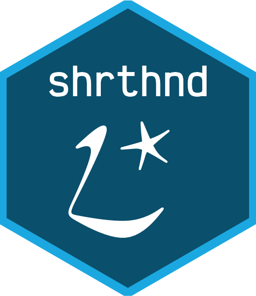

<!-- README.md is generated from README.Rmd. Please edit that file -->

```{r, include = FALSE}
knitr::opts_chunk$set(
  collapse = TRUE,
  comment = "#>",
  fig.path = "man/figures/README-",
  out.width = "100%"
)
```

# shrthnd 

<!-- badges: start -->
[](https://github.com/mattkerlogue/shrthnd/actions/workflows/R-CMD-check.yaml)
<!-- badges: end -->

Data is often published with shorthand and symbols, and regularly these markers
are found in the same container as the value. The aim of `{shrthnd}` is to
process character vectors of numerical data that contain non-numeric shorthand
and symbols.

## Installation

You can install the development version of shrthnd like so:

``` r
# install.packages("remotes")
remotes::install_github("mattkerlogue/shrthnd")
```

## Example

```{r}
library(shrthnd)
x <- c("12", "34.567", "[c]", "NA", "56.78 [e]", "78.9", "90.123[e]", 
       "321.09*", "987.564 \u2021", ".", "..")

sh_x <- shrthnd_num(x)
shrthnd_list(sh_x)
tibble::tibble(x = x, sh_x = sh_x, as_num = as.numeric(sh_x), 
               as_char = as.character(sh_x), tag = shrthnd_tags(sh_x), 
               as_shrthnd = as_shrthnd(sh_x), 
               as_shrthnd2 = as_shrthnd(sh_x, digits = 3))
```


## Logo

The shrthnd logo is a combination of the word "shorthand" written in
[Pitman shorthand](https://en.wikipedia.org/wiki/Pitman_shorthand) and an
asterisk.
